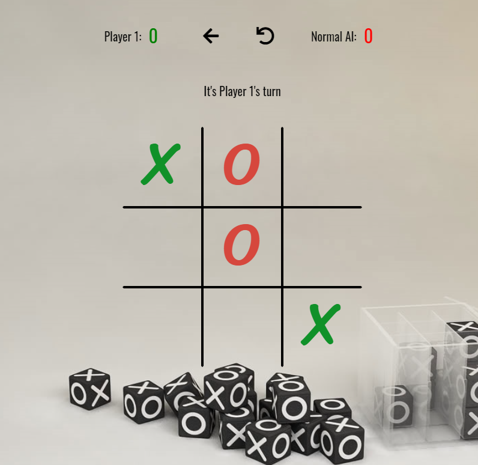

# Tic Tac Toe Game with Minimax Algorithm

Play now: https://tic-tac-toe-2p-minimax.netlify.app/
## Table of Contents
  - [General Information](#general-information)
  - [Installation](#installation)
  - [Usage](#usage)
  - [Computer Difficulties](#computer-difficulties)
  - [2 Player Games](#2-player-games)
  - [Technologies](#technologies)
  - [Status](#status)
  - [Todo](#todo)

## General Information 

Tic-Tac-Toe (or Noughts and Crosses) is a classic childhood game in which two players alternately put crosses and circles in one of the compartments of a square grid of nine spaces; the object is to get a row of three crosses or three circles before the opponent does.

In this implementation of the game you can play locally against a friend, or play against the computer with 3 different difficulties: 
- Easy: The computer will play randomly.
- Normal: The computer is somewhat challenging.
- Unbeatable: The computer cannot be beaten.

In a future release you will be able to play against other players online instead of locally.

## Installation
To install the game locally you need to first clone the repository by clicking running `git clone https://github.com/jamesgower/tic-tac-toe.git` from the directory that you wish to install it to. Once the repository has been cloned you will need to install the projects' dependencies by running `npm install` from the root directory of the cloned repository. To access the app you can then run `npm run start` from the root directory, which will allow you to view the game at http://localhost:3000 .

## Usage 

The simplest way to play Tic-Tac-Toe is by following [this](https://tic-tac-toe-2p-minimax.netlify.app/) link (https://tic-tac-toe-2p-minimax.netlify.app/). If you would prefer to install the repository locally and running it that way then please follow the above method [here](#installation).

There are two ways to play this game - against the computer (with 3 different difficulties) or playing locally against a friend on the same PC.
### Computer Difficulties

#### Easy

The 'easy' difficulty is obviously the simplest difficulty, where the computer will place random tiles on the board with no attempt to win the game unless it happens to randomly occur. Simple to get victories for all players.

#### Normal 

The 'normal' difficulty will give players a bit more of a challenge. There is a 50% chance that the computer will choose the best possibly move, however this is also a 50% chance that it will place a tile randomly. 'Normal' difficulty will give users a challenge, but it can also be beaten.

#### Unbeatable

As the name suggests the 'unbeatable' difficulty is physically impossible to beat. The minimax algorithm allows the computer to place the best possible move from the current boards state, so there is no possible way to beat them. You can try - but you will fail!
## Technologies
- React 17
- Create React App (TypeScript Template)
- TypeScript
- Redux
- React-Redux
- MiniMax Algorithm (For Unbeatable AI)
- MUI (Material UI)

## Status

The game is currently in a working state where users can both play against friends locally, and play against all 3 different AI difficulties. New features are planned to be completed, which are shown below ([here](#todo)).

## Todo

- Testing needs to be refactored and uploaded
- Look into creating two player games over the internet via socket.io
- Save player stats to their own profile (win/loss/draw etc)
