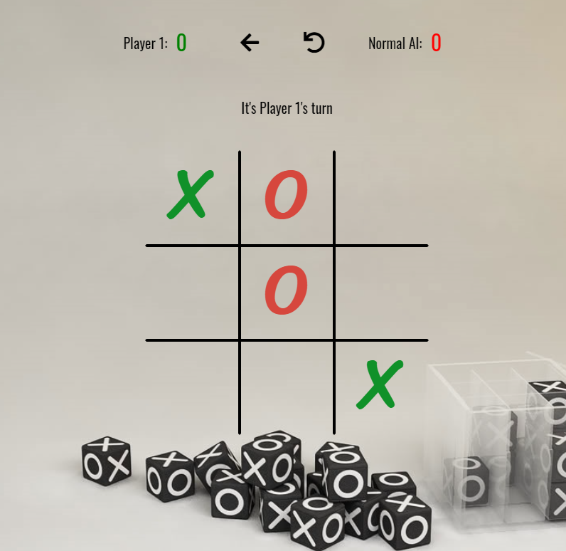

# Tic Tac Toe



**Play now:** [https://tictactoe.jamesgower.dev](https://tictactoe.jamesgower.dev)

## Table of Contents

- [General Information](#general-information)
- [Game Modes](#game-modes)
- [Online 1v1](#online-1v1)
- [Computer Difficulties](#computer-difficulties)
- [Local 2 Player](#local-2-player)
- [Installation](#installation)
- [Development](#development)
- [Technologies](#technologies)
- [Status](#status)
- [Todo](#todo)

## General Information

Tic-Tac-Toe (or Noughts and Crosses) is a classic game where two players take turns placing X and O on a 3×3 grid. The first to get three in a row wins.

This version supports local play, three AI difficulty levels, and real-time online multiplayer.

## Game Modes

On the home screen you can choose:

- **Computer** — play against the AI (Easy, Normal, or Unbeatable)
- **Local** — two players on the same device
- **Online 1v1** — play against someone over the internet

## Online 1v1

Online games use a lobby system backed by Socket.io.

### Create a room

1. Choose **Online 1v1** from the home screen
2. Enter your name and click **Create Room**
3. Share the 6-character room code with your opponent (use the copy button next to the code)
4. Wait for them to join — the game starts automatically

### Join a room

1. Choose **Online 1v1** → **Join Room**
2. Enter your name
3. Either:
   - Pick a room from the **Open rooms** list, or
   - Enter a room code manually and click **Join Game**

Moves are synced in real time. If your opponent disconnects, you’ll be notified.

## Computer Difficulties

### Easy

The computer plays random moves unless it accidentally lines up a win.

### Normal

Roughly a 50/50 mix of the best move and a random move — beatable, but not trivial.

### Unbeatable

Uses the minimax algorithm to always pick the optimal move. You cannot win; at best you can draw.

## Local 2 Player

Two players share one device, taking turns on the same board. Enter both names on the setup screen and play as usual.

## Installation

Clone the repository and install dependencies:

```bash
git clone https://github.com/GWR94/tic-tac-toe.git
cd tic-tac-toe
npm install
```

## Development

The app runs as two processes in development: a Vite frontend (port 3000) and an Express/Socket.io server (port 3001). API and WebSocket traffic is proxied through Vite.

```bash
npm run dev
```

Open [http://localhost:3000](http://localhost:3000).

Other scripts:

| Command | Description |
|---------|-------------|
| `npm run dev` | Frontend + game server (development) |
| `npm run dev:web` | Frontend only |
| `npm run server:dev` | Game server only |
| `npm run build` | Type-check and build for production |
| `npm test` | Run unit tests |
| `npm start` | Serve production build + game server |

Production is deployed to Railway as a single service — the server serves the built frontend from `dist/` and handles Socket.io on the same port.

## Technologies

- React 17
- TypeScript
- Vite
- Redux / React-Redux
- MUI (Material UI)
- Socket.io (online multiplayer)
- Express (game server)
- Minimax algorithm (Unbeatable AI)

## Status

The game is fully playable in all modes: local 2-player, all three AI difficulties, and online 1v1 with room lobbies.

## Todo

- Save player stats to a profile (win/loss/draw)
